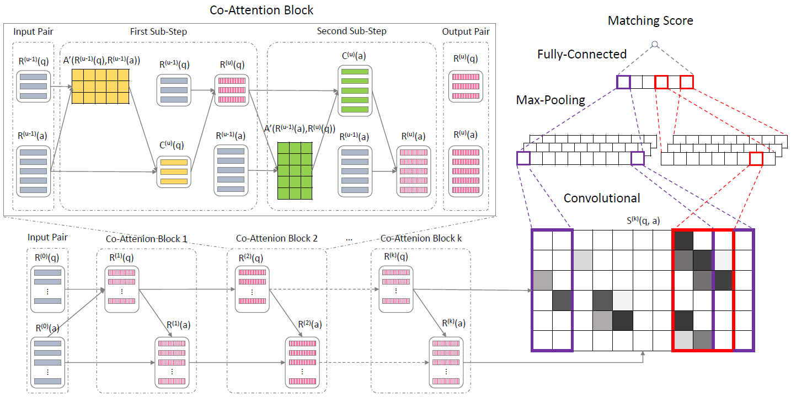
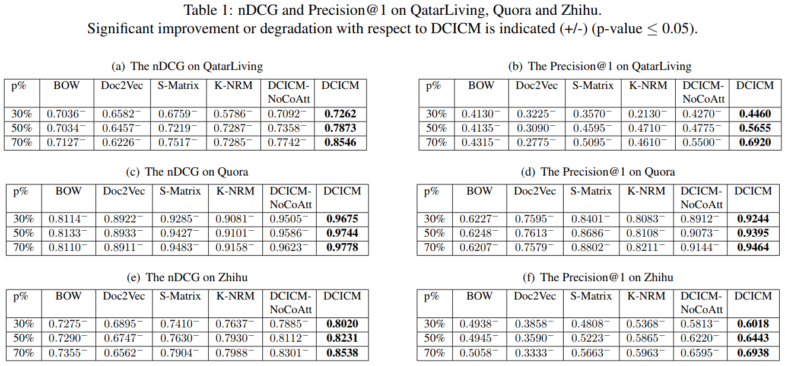

<!-- ## Implementation and Datasets of Deep Co-attention based Interactive Convolutional Matching for Community Question Answering -->

# Deep Co-attention based Interactive Convolutional Matching for Community Question Answering (DCICM)

This repository contains:
+ The TensorFlow implementation of DCICM
+ The three datasets used in DCICM

The content of this README is as follows:

+ [Framework](#Framework)
+ [Experimental Results with Significance Test](#user-content-experimental-results-with-significance-test)
+ [Datasets](Datasets)

## Framework




## Experimental Results with Significance Test




## Experimental Results with Significance Test


## Datasets
DCICM are evaluated on a well-studied benchmark dataset (QatarLiving) and two real-world datasets(Quora and Zhihu):

### QatarLiving Dataset
The QatarLiving dataset is already in the `CQA_datasets` directory.

### Quora and Zhihu Datasets
#### Overview
We build two real-world CQA datasets: Quora and Zhihu.
Specifically, the Quora dataset is a large dataset which contains 109,034 questions and 451,109 answers.
You can download them here: 

| File                     | Uncompressed Size| Compressed Size   | Download Link    |
| ----                     | ----             | ----              | ----             |
| CQA_webpage_datasets.zip | 31GB             | 7GB               | [Download Link](https://pan.baidu.com/s/1TnSaHPQONrPRzZ7YlCQH0A) |
| CQA_datasets.zip         | 700M             | 243M              | [Download Link](https://pan.baidu.com/s/1fWi9H_ACCt4fjmI5bA5teg) |


CQA_webpage_datasets.zip contains:
```
CQA_webpage_datasets
├── quora
│   ├── webpage.bson (30G)
│   └── webpage.metadata.json (4.0K)
└── zhihu
    ├── webpage.bson (722M)
    └── webpage.metadata.json (4.0K)
```

CQA_datasets.zip contains:
```
CQA_datasets
├── quora
│   ├── qa.bson (682M)
│   └── qa.metadata.json (4.0K)
└── zhihu
    ├── qa.bson (18M)
    └── qa.metadata.json (4.0K)
```


#### Raw Webpage Data

We collect a large set of webpages from Quora and Zhihu to build two datasets for evaluation.
First, we write two Java web crawlers [xxxx]() to download raw webpages from the two CQA sites.
We employ MongoDB to store the raw webpage data, since it contains a large amount of small files.
The MongoDB collections (tables) are exported into bson files by the `mongodump` command and can be restored by the `mongorestore` command.

The raw webpage data can be imported into MongoDB by the following command:
```bash
sh import_webpage_datasets_to_mongodb.sh MONGO_HOST:MONGO_PORT
```
where you should replace `MONGO_HOST` and `MONGO_PORT` with your MongoDB configuration.
Note that the raw webpage data is __optional__ since we provide the extracted question and answer data.


#### Extract QA Data from Raw Webpages

We employ Spark and Jsoup to extract questions and answers from the raw webpages.
The source code can be found here.

Each webpage is processed into a question and the associated answers.
Note that the content of the extracted questions and answers is stored as HTML code snippets, which can preserve the original multi-media information, such that this dataset can also be used for multi-media tasks. 
The extracted questions and answers are also stored in MongoDB and exported as CQA_datasets.zip:

| File             | Uncompressed Size| Compressed Size   | Download Link    |
| ----             | ----             | ----              | ----             |
| CQA_datasets.zip | 700M             | 243M              | [Download Link](https://pan.baidu.com/s/1fWi9H_ACCt4fjmI5bA5teg) |


The extracted question and answer data can be imported into MongoDB by the following command:
```bash
sh import_datasets_to_mongodb.sh MONGO_HOST:MONGO_PORT
```
where you should replace `MONGO_HOST` and `MONGO_PORT` with your MongoDB configuration.


#### Data Processing

The extracted questions and answers should be processed into numeral features:
+ The text content of each question and answer is transformed into a sequence of word indices.
+ Each question and answer is assigned an index.
+ The original relations between questions and answers are modelled by a graph.

The data processing code can be found in [build_network.py](https://github.com/briefpaper/DCICM/blob/master/dcicm/data/build_network.py).


